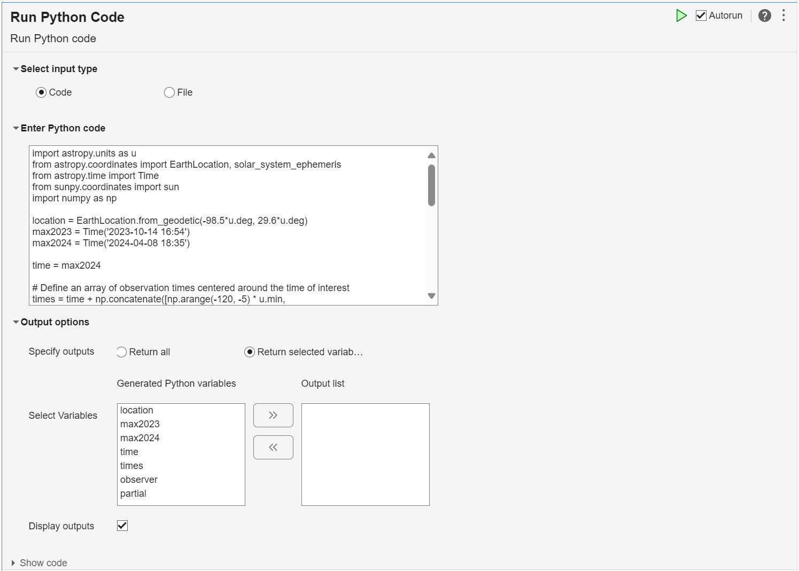
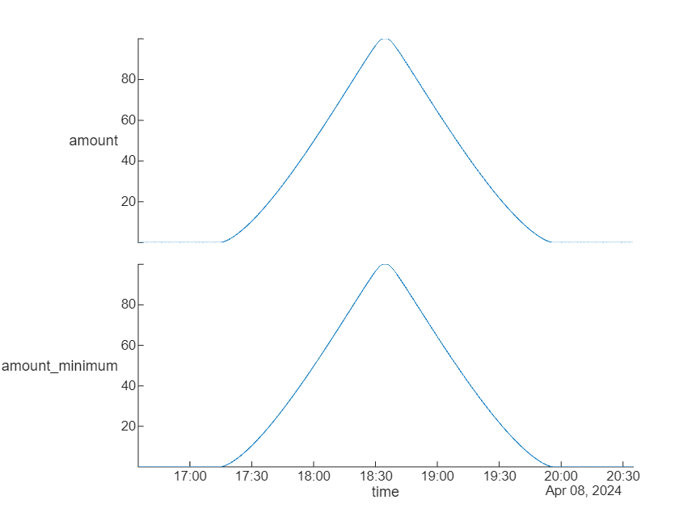
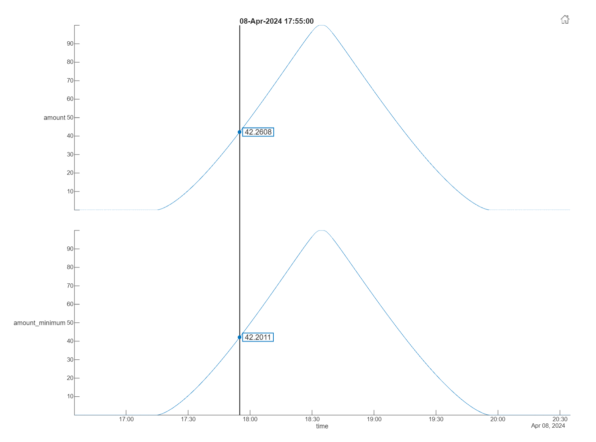
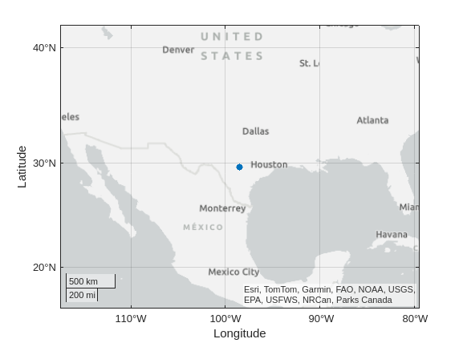

# Eclipse 🌑🌒🌓

[](https://matlab.mathworks.com/open/github/v1?repo=yanndebray/eclipse&file=livescript.mlx)

View Sunpy app in Focus mode:
https://matlab.mathworks.com/open/github/v1?repo=yanndebray/eclipse&file=sunpy.mlapp&focus=true

Analyze the total solar eclipse

2024\-04\-08

https://github.com/yanndebray/eclipse/assets/128002745/f4d92364-e9b4-4a92-af09-97cf625087b4


<a name="beginToc"></a>

## Table of Contents
[Context](#context)
 
[Resources](#resources)
 
[Set up environment](#set-up-environment)
 
[Import data with Python live task](#import-data-with-python-live-task)
 
[Transform Pandas Dataframe to MATLAB Table](#transform-pandas-dataframe-to-matlab-table)
 
[Export to ipynb and md](#export-to-ipynb-and-md)
 
<a name="endToc"></a>

# Context

In this tutorial, we will show how to use MATLAB with the SunPy community Python library for Solar Physics


# Resources
-  [https://github.com/yanndebray/matlab\-with\-python\-book](https://github.com/yanndebray/matlab-with-python-book) 
-  [https://docs.sunpy.org/en/stable/generated/gallery/showcase/eclipse\_amount.html](https://docs.sunpy.org/en/stable/generated/gallery/showcase/eclipse_amount.html)  

# Set up environment
```matlab
setup
```

```matlabTextOutput
Warning: Name is nonexistent or not a directory: /MATLAB Drive/eclipse/pip
Defaulting to user installation because normal site-packages is not writeable
Requirement already satisfied: sunpy in /home/matlab/.local/lib/python3.10/site-packages (5.1.2)
Requirement already satisfied: jplephem in /home/matlab/.local/lib/python3.10/site-packages (2.21)
Requirement already satisfied: pandas in /home/matlab/.local/lib/python3.10/site-packages (2.2.1)
Requirement already satisfied: astropy!=5.1.0,>=5.0.6 in /home/matlab/.local/lib/python3.10/site-packages (from sunpy) (6.0.1)
Requirement already satisfied: numpy>=1.21.0 in /home/matlab/.local/lib/python3.10/site-packages (from sunpy) (1.26.4)
Requirement already satisfied: packaging>=19.0 in /home/matlab/.local/lib/python3.10/site-packages (from sunpy) (24.0)
Requirement already satisfied: parfive>=2.0.0 in /home/matlab/.local/lib/python3.10/site-packages (from parfive[ftp]>=2.0.0->sunpy) (2.1.0)
Requirement already satisfied: pyerfa in /home/matlab/.local/lib/python3.10/site-packages (from sunpy) (2.0.1.3)
Requirement already satisfied: python-dateutil>=2.8.2 in /home/matlab/.local/lib/python3.10/site-packages (from pandas) (2.9.0.post0)
Requirement already satisfied: pytz>=2020.1 in /home/matlab/.local/lib/python3.10/site-packages (from pandas) (2024.1)
Requirement already satisfied: tzdata>=2022.7 in /home/matlab/.local/lib/python3.10/site-packages (from pandas) (2024.1)
Requirement already satisfied: astropy-iers-data>=0.2024.2.26.0.28.55 in /home/matlab/.local/lib/python3.10/site-packages (from astropy!=5.1.0,>=5.0.6->sunpy) (0.2024.4.8.0.32.4)
Requirement already satisfied: PyYAML>=3.13 in /usr/lib/python3/dist-packages (from astropy!=5.1.0,>=5.0.6->sunpy) (5.4.1)
Requirement already satisfied: tqdm>=4.27.0 in /home/matlab/.local/lib/python3.10/site-packages (from parfive>=2.0.0->parfive[ftp]>=2.0.0->sunpy) (4.66.2)
Requirement already satisfied: aiohttp in /home/matlab/.local/lib/python3.10/site-packages (from parfive>=2.0.0->parfive[ftp]>=2.0.0->sunpy) (3.9.3)
Requirement already satisfied: aioftp>=0.17.1 in /home/matlab/.local/lib/python3.10/site-packages (from parfive[ftp]>=2.0.0->sunpy) (0.22.3)
Requirement already satisfied: six>=1.5 in /usr/lib/python3/dist-packages (from python-dateutil>=2.8.2->pandas) (1.16.0)
Requirement already satisfied: aiosignal>=1.1.2 in /home/matlab/.local/lib/python3.10/site-packages (from aiohttp->parfive>=2.0.0->parfive[ftp]>=2.0.0->sunpy) (1.3.1)
Requirement already satisfied: attrs>=17.3.0 in /home/matlab/.local/lib/python3.10/site-packages (from aiohttp->parfive>=2.0.0->parfive[ftp]>=2.0.0->sunpy) (23.2.0)
Requirement already satisfied: frozenlist>=1.1.1 in /home/matlab/.local/lib/python3.10/site-packages (from aiohttp->parfive>=2.0.0->parfive[ftp]>=2.0.0->sunpy) (1.4.1)
Requirement already satisfied: multidict<7.0,>=4.5 in /home/matlab/.local/lib/python3.10/site-packages (from aiohttp->parfive>=2.0.0->parfive[ftp]>=2.0.0->sunpy) (6.0.5)
Requirement already satisfied: yarl<2.0,>=1.0 in /home/matlab/.local/lib/python3.10/site-packages (from aiohttp->parfive>=2.0.0->parfive[ftp]>=2.0.0->sunpy) (1.9.4)
Requirement already satisfied: async-timeout<5.0,>=4.0 in /home/matlab/.local/lib/python3.10/site-packages (from aiohttp->parfive>=2.0.0->parfive[ftp]>=2.0.0->sunpy) (4.0.3)
Requirement already satisfied: idna>=2.0 in /home/matlab/.local/lib/python3.10/site-packages (from yarl<2.0,>=1.0->aiohttp->parfive>=2.0.0->parfive[ftp]>=2.0.0->sunpy) (3.6)
```

```matlab
pipshow("sunpy")
```

```matlabTextOutput
Name: sunpy
Version: 5.1.2
Summary: SunPy core package: Python for Solar Physics
Home-page: https://sunpy.org
Author: The SunPy Community
Author-email: sunpy@googlegroups.com
License: BSD 2-Clause
Location: /home/matlab/.local/lib/python3.10/site-packages
Requires: astropy, numpy, packaging, parfive, pyerfa
Required-by: 
```

# Import data with Python live task





```matlab
% Python code input
pycode4 = [...
"import astropy.units as u",...
"from astropy.coordinates import EarthLocation, solar_system_ephemeris",...
"from astropy.time import Time",...
"from sunpy.coordinates import sun",...
"import numpy as np",...
"import pandas as pd",...
"",...
"# Define the geodetic coordinates",...
"latitude = 29.6 * u.deg",...
"longitude = -98.5 * u.deg  # Note that the longitude should come first",...
"",...
"# Create the EarthLocation object",...
"location = EarthLocation.from_geodetic(longitude, latitude)",...
"max2023 = Time('2023-10-14 16:54')",...
"max2024 = Time('2024-04-08 18:35')",...
"",...
"time = max2024",...
"",...
"# Define an array of observation times centered around the time of interest",...
"times = time + np.concatenate([np.arange(-120, -5) * u.min,",...
"                                np.arange(-300, 300) * u.s,",...
"                                np.arange(5, 121) * u.min])",...
"",...
"# Create an observer coordinate for the time array",...
"observer = location.get_itrs(times)",...
"",...
"# Calculate the eclipse amounts using a JPL ephemeris",...
"with solar_system_ephemeris.set('de440s'):",...
"    amount = sun.eclipse_amount(observer)",...
"    amount_minimum = sun.eclipse_amount(observer, moon_radius='minimum')",...
"",...
"# Calculate the start/end points of partial/total solar eclipse",...
"partial = np.flatnonzero(amount > 0)",...
"if len(partial) > 0:",...
"    print(""Eclipse detected:"")",...
"    start_partial, end_partial = times[partial[[0, -1]]]",...
"    print(f""  Partial solar eclipse starts at {start_partial} UTC"")",...
"",...
"    total = np.flatnonzero(amount_minimum == 1)",...
"    if len(total) > 0:",...
"        start_total, end_total = times[total[[0, -1]]]",...
"        print(f""  Total solar eclipse starts at {start_total} UTC\n""",...
"                f""  Total solar eclipse ends at {end_total} UTC"")",...
"    print(f""  Partial solar eclipse ends at {end_partial} UTC"")",...
"",...
"df = pd.DataFrame({'time': times.to_datetime(), 'amount': amount, 'amount_minimum': amount_minimum})",...
""...
];

[latitude, longitude, df] = pyrun(pycode4, ...
     [ "latitude" "longitude" "df" ])
```

```matlabTextOutput
Eclipse detected:
  Partial solar eclipse starts at 2024-04-08 17:15:00.000 UTC
  Total solar eclipse starts at 2024-04-08 18:33:44.000 UTC
  Total solar eclipse ends at 2024-04-08 18:35:33.000 UTC
  Partial solar eclipse ends at 2024-04-08 19:55:00.000 UTC
latitude = 
  Python Quantity:

   29.6000

    Use details function to view the properties of the Python object.

    Use double function to convert to a MATLAB array.

longitude = 
  Python Quantity:

  -98.5000

    Use details function to view the properties of the Python object.

    Use double function to convert to a MATLAB array.

df = 
  Python DataFrame with properties:

          T: [1x1 py.pandas.core.frame.DataFrame]
         at: [1x1 py.pandas.core.indexing._AtIndexer]
      attrs: [1x1 py.dict]
       axes: [1x2 py.list]
    columns: [1x1 py.pandas.core.indexes.base.Index]
     dtypes: [1x1 py.pandas.core.series.Series]
      empty: 0
      flags: [1x1 py.pandas.core.flags.Flags]
        iat: [1x1 py.pandas.core.indexing._iAtIndexer]
       iloc: [1x1 py.pandas.core.indexing._iLocIndexer]
      index: [1x1 py.pandas.core.indexes.range.RangeIndex]
        loc: [1x1 py.pandas.core.indexing._LocIndexer]
       ndim: [1x1 py.int]
      shape: [1x2 py.tuple]
       size: [1x1 py.int]
     values: [1x1 py.numpy.ndarray]

                       time  amount  amount_minimum
    0   2024-04-08 16:35:00     0.0             0.0
    1   2024-04-08 16:36:00     0.0             0.0
    2   2024-04-08 16:37:00     0.0             0.0
    3   2024-04-08 16:38:00     0.0             0.0
    4   2024-04-08 16:39:00     0.0             0.0
    ..                  ...     ...             ...
    826 2024-04-08 20:31:00     0.0             0.0
    827 2024-04-08 20:32:00     0.0             0.0
    828 2024-04-08 20:33:00     0.0             0.0
    829 2024-04-08 20:34:00     0.0             0.0
    830 2024-04-08 20:35:00     0.0             0.0
    
    [831 rows x 3 columns]

```

```matlab

% Clean up
clear pycode4;
```

# Transform Pandas Dataframe to MATLAB Table
```matlab
% T = table(df)
TT = timetable(df)
```
| |time|amount|amount_minimum|
|:--:|:--:|:--:|:--:|
|1|08-Apr-2024 16:35:00|0|0|
|2|08-Apr-2024 16:36:00|0|0|
|3|08-Apr-2024 16:37:00|0|0|
|4|08-Apr-2024 16:38:00|0|0|
|5|08-Apr-2024 16:39:00|0|0|
|6|08-Apr-2024 16:40:00|0|0|
|7|08-Apr-2024 16:41:00|0|0|
|8|08-Apr-2024 16:42:00|0|0|
|9|08-Apr-2024 16:43:00|0|0|
|10|08-Apr-2024 16:44:00|0|0|
|11|08-Apr-2024 16:45:00|0|0|
|12|08-Apr-2024 16:46:00|0|0|
|13|08-Apr-2024 16:47:00|0|0|
|14|08-Apr-2024 16:48:00|0|0|

```matlab
% stackedplot(TT)
plot(TT.time,TT.amount)
```





```matlab
% San Antonio, Texas
lat = py.numpy.array(latitude); lat = double(lat);
lon = py.numpy.array(longitude); lon = double(lon);
geoscatter(lat,lon, 'filled')
```



# Export to ipynb and md
```matlab
export('livescript.mlx','README.md');
export('livescript.mlx','notebook.ipynb');
```
